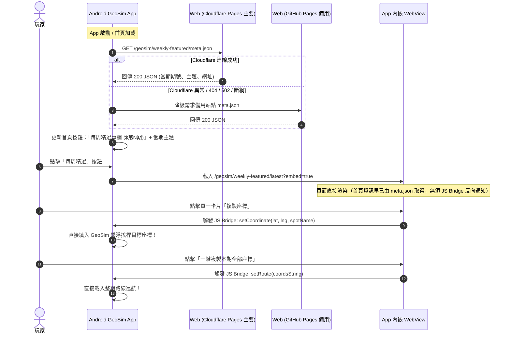

# GeoSim 每週精選專欄 (Weekly Featured) 前端與 Android App 整合規格說明書

> **文件版本**：v1.0.0  
> **更新日期**：2026-09-29  
> **維護團隊**：Kairos Vector Studio  
> **狀態**：Web 端已於本機實作完成並通過編譯，待決策後發布至 GitHub 正式維護

---

## 📌 1. 架構總覽與整合流程

為配合 **GeoSim Android App** 首頁動態顯示當週專欄期號與主題，並提供流暢的 JS Bridge 座標與路線聯動，Web 站點提供「**輕量元資料端點 (meta.json)**」與「**App 專用無痕嵌入頁面 (?embed=true)**」。



---

## 🌐 2. 輕量元資料端點 (`meta.json`)

Web 端點於每次 Astro Build 時自動由 `locations.json` 抽取最新一期資料生成靜態 JSON，免人工維護。

- **主要路徑 (Cloudflare Pages)**：  
  `https://kairosvector.pages.dev/geosim/weekly-featured/meta.json`
- **備用路徑 (GitHub Pages)**：  
  `https://kairosvector.github.io/geosim/weekly-featured/meta.json`  
  *(註：若使用個人 Repo，路徑可能為 `https://kevycheng.github.io/kairosVector_web/...`，見下方決策項)*

### 2.1 JSON Schema 結構

```json
{
  "schemaVersion": 1,
  "issue": 6,
  "issueFormatted": "第 06 期",
  "title": "漫遊全球：精選【燈塔】巡航特輯",
  "publishedAt": "2026-10-03",
  "dateRange": "2026-10-03 ~ 2026-10-09",
  "category": "🗺️ 全球探索",
  "spotsCount": 20,
  "url": "https://kairosvector.pages.dev/geosim/weekly-featured/latest?embed=true",
  "backupUrl": "https://kairosvector.github.io/geosim/weekly-featured/latest?embed=true"
}
```

### 2.2 欄位定義說明

| 欄位名 | 型別 | 必填 | 範例值 | 說明 |
| :--- | :--- | :---: | :--- | :--- |
| `schemaVersion` | `int` | 是 | `1` | 規格版本號，便於未來向後相容判斷 |
| `issue` | `int` | 是 | `6` | 純數字期號，供 App 做大小比較或邏輯運算 |
| `issueFormatted`| `string`| 是 | `"第 06 期"` | 格式化期號，App 可直接印在 UI 上免組裝 |
| `title` | `string`| 是 | `"漫遊全球：精選【燈塔】巡航特輯"` | 當期專欄主題標題 |
| `publishedAt` | `string`| 是 | `"2026-10-03"` | 發布起始日期 (ISO YYYY-MM-DD) |
| `dateRange` | `string`| 否 | `"2026-10-03 ~ 2026-10-09"` | 完整推薦巡航週期字串 |
| `category` | `string`| 否 | `"🗺️ 全球探索"` | 主題分類標籤 |
| `spotsCount` | `int` | 否 | `20` | 本期推薦景點/座標總數 |
| `url` | `string`| 是 | `"https://.../latest?embed=true"` | 主要 WebView 開啟網址 |
| `backupUrl` | `string`| 否 | `"https://.../latest?embed=true"` | 備用 WebView 開啟網址 |

---

## 📱 3. App 嵌入專用頁面規格 (`?embed=true`)

當 URL 帶有 `?embed=true` 參數時，Web 前端會啟動「App 內嵌模式」：

### 3.1 視覺與介面自動調整
1. **主題鎖定**：預設強制切換為高對比白底主題（`data-theme="vibrant"`），完全融入原生 App 質感，無閃爍。
2. **自動隱藏非必要元件**：
   - 頂部導覽列（Navbar & Logo）
   - 「← 返回 GeoSim 產品專頁」按鈕
   - 「← 返回專欄總覽」按鈕
   - 底部其他產品促銷卡片（`.weekly-promo-card`）
   - 底部全站版權列與頁尾導覽
   - 外部社群喚醒按鈕（隱藏 Line、Threads 外部喚醒，僅保留一鍵複製文案，避免 App 內跳轉困擾）
3. **保留核心功能**：
   - 封面橫幅與專欄介紹
   - 篩選類別（蘑菇、巨型大花、台灣、日本、國際）
   - **檢視切換器**：支援 `[ 📰 詳細列表 | 🧱 瀑布流 ]` 即時切換
   - 座標複製按鈕（優先喚醒 Android JS Bridge）

### 3.2 支援的 URL 參數
- `/geosim/weekly-featured/latest?embed=true`：開啟最新一期嵌入版（預設列表）
- `/geosim/weekly-featured/latest?embed=true&view=masonry`：直接以**雙欄瀑布流**開啟

---

## ⚡ 4. Android JS Bridge 規格 (`AndroidGeoSim`)

Web 頁面已內建原生橋接偵測。若存在 `window.AndroidGeoSim` 物件，會優先呼叫原生方法；若在一般瀏覽器開啟則自動降級為原生剪貼簿 `navigator.clipboard.writeText`。

> 💡 **架構設計決策說明**：  
> 原先曾評估由網頁載入時主動呼叫 `setIssueInfo` 通知 App，但經評估「由 App 直接在背景透過輕量 `meta.json` 抓取當期資訊」更乾淨、首頁啟動更快且完全解耦。因此 **取消 `setIssueInfo` JS Bridge**，JS Bridge 專注於處理使用者在網頁上的互動操作！

### 4.1 介面方法清單

#### 方法 1：單點傳送座標 `setCoordinate`
* **觸發時機**：點擊景點卡片上的「複製座標」按鈕。
* **JavaScript 呼叫**：
  ```javascript
  window.AndroidGeoSim.setCoordinate(lat, lng, spotName);
  // 範例: window.AndroidGeoSim.setCoordinate(46.546526, -87.376418, "港灣燈塔");
  ```
* **Android 原生接收**：
  ```java
  @JavascriptInterface
  public void setCoordinate(double lat, double lng, String spotName) {
      // 1. 將經緯度填入 GeoSim 懸浮搖桿目標
      // 2. 原生彈出 Toast 或微震動回饋：「已設定目標：港灣燈塔」
  }
  ```

#### 方法 2：批次傳送整期路線 `setRoute`
* **觸發時機**：點擊頂部「一鍵複製本期全部座標 (GeoSim 格式)」。
* **JavaScript 呼叫**：
  ```javascript
  window.AndroidGeoSim.setRoute(coordsString);
  // coordsString 為多行經緯度，每行一組 "lat,lng"
  ```
* **Android 原生接收**：
  ```java
  @JavascriptInterface
  public void setRoute(String coordsString) {
      // 1. 解析多行座標 (split by newline)
      // 2. 直接匯入 GeoSim 巡航路線清單並提示使用者
  }
  ```

---

## 🛡️ 5. 高可用性、異常偵測與 UI 應變 (Fault Tolerance)

針對「**若 Web 服務出問題（如 Cloudflare 掛掉、被封鎖或斷網），App 端該如何感知與應變**」的完整方案：

### 5.1 App 端如何知道 Web 出問題？
1. **背景抓取 `meta.json` 失敗**：
   - HTTP 狀態碼 != 200（例如 404, 500, 502 Bad Gateway）
   - 連線逾時（SocketTimeoutException / UnknownHostException）
2. **WebView 載入攔截**：
   - Android `WebViewClient.onReceivedError()` 攔截網路中斷與 DNS 失敗。
   - `WebViewClient.onReceivedHttpError()` 攔截 4xx / 5xx 錯誤。

### 5.2 App 端 UI 應變三層防護：

| 層級 | 情況 | App 端 UI 應變行為 |
| :--- | :--- | :--- |
| **第一層：自動容錯切換 (Failover)** | Cloudflare 抓取失敗 | 自動切換至備用網址 (GitHub Pages 或 Remote Config) 重試，使用者完全無感知。 |
| **第二層：本地快取降級 (Offline Fallback)** | 雙網址皆無法連線 (完全離線) | 首頁按鈕讀取上次快取的期數資料；若曾開過 WebView，顯示離線快取內容。 |
| **第三層：優雅錯誤提示 (Graceful Error State)**| 首次開啟無快取且無網路 | WebView 不顯示原生難看的「ERR_INTERNET_DISCONNECTED」，而是顯示 GeoSim 原生設計的「目前訊號不佳 / 伺服器維護中」插圖與「重新整理」按鈕。 |

---

## ⚖️ 6. 規格與 Web 現況對比（已拍板決策記錄）

| 項目 | 本地 Web App 現況 | 決策結果 |
| :--- | :--- | :--- |
| **A. 期號與主題獲取** | 早期曾有 `setIssueInfo` JS Bridge 方案 | **已決策取消 `setIssueInfo`**：全面改為 App 直接 GET `meta.json`，解耦乾淨且首頁呈現最即時。 |
| **B. `issue` 期號格式** | `locations.json` 內為 `"第 06 期"` | **已實作雙支援**：`issue: 6` (int) + `issueFormatted: "第 06 期"` (string)，App 兩種皆可直接取用。 |
| **C. `meta.json` 產出** | 自動建置 | **已實作自動產出**：已配置 `app/src/pages/geosim/weekly-featured/meta.json.ts`，每次 build 自動從 `locations.json` 產出。 |
| **D. `publishedAt` 日期** | 專欄為巡航週期 `"2026-10-03 ~ 2026-10-09"` | **已實作雙支援**：`publishedAt: "2026-10-03"` (起始日) + `dateRange: "2026-10-03 ~ 2026-10-09"`。 |
| **E. 瀏覽模式 (瀑布流)** | 已實作 View Switcher 支援 | **待驗證確認**：支援 `?view=masonry` 參數，App 可直接在 URL 指定 `?view=masonry` 預設以雙欄瀑布流展示。 |

---

## 📋 7. 待辦事項與維護清單 (TODO Checklist)

- [x] **Web 端**：新增 `meta.json.ts` 動態端點，支援自動生成最新專欄元資料。
- [x] **Web 端**：實作 `[issue].astro` 瀑布流 (Masonry View) 與 `?view=masonry` 支援。
- [x] **Web 端**：移除 `setIssueInfo`，保留 `setCoordinate` 與 `setRoute` 並支援剪貼簿自動降級。
- [x] **GitHub 遠端**：建立遠端 Repository (https://github.com/kevycheng/kairosVector_web) 並推向上線。
- [x] **GitHub Pages**：配置 `.github/workflows/deploy.yml` 支援自動構建備用站點。
- [ ] **Cloudflare Pages**：部署最新 Web 版本，使第 06 期與 `meta.json` 正式上線。
- [ ] **Android App 端**：
  - [ ] 首頁實作 HTTP GET 請求 `meta.json`（OkHttp / Retrofit）。
  - [ ] 首頁按鈕動態綁定文字 `每周精選專欄 ($第N期)` 與主題。
  - [ ] WebView 加入 `@JavascriptInterface` (`setCoordinate`, `setRoute`)。
  - [ ] WebView 加入 `onReceivedError` 原生錯誤重試頁面。

